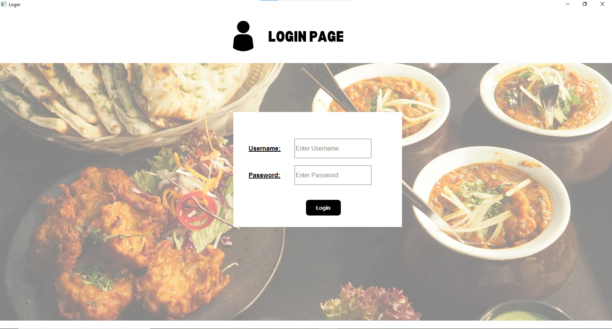
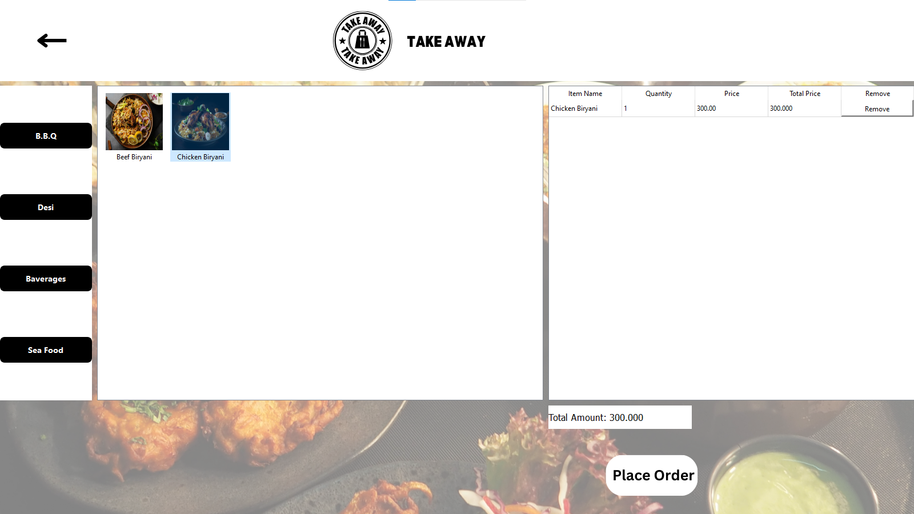
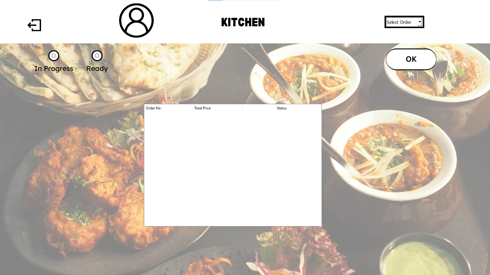
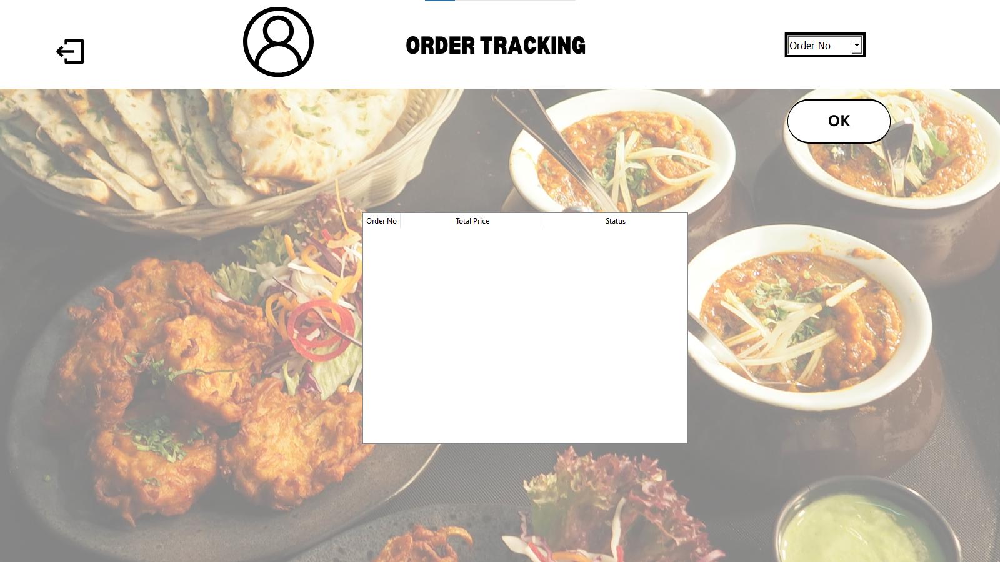

# Restaurant Management System

A desktop-based Restaurant Management System developed using **C++ (Qt Framework)** and **MySQL**.  
The system helps restaurants manage orders, kitchen operations, billing, and order tracking efficiently.

---

## Features

- User Login System
- Dine-In Order Management
- Takeaway Order Management
- Dyanmic Button For Category And Items In Menu
- Kitchen Order Tracking
- Order Status Updates (Pending, In Progress, Ready)
- Automatic Ready Order Notifications
- Daily Order Tracking
- Bill Generation System
- MySQL Database Integration

---

## Technologies Used

- C++
- Qt Framework
- MySQL
- Qt Creator

---

## System Architecture

Client-Server architecture where multiple client computers connect to a centralized MySQL database server.

---

## Screenshots

### Login Page

### Takeaway Window

### Kitchen Panel

### Order Tracking

---

## Installation

1. Install **Qt Creator**
2. Install **MySQL Server**
3. Import database file
